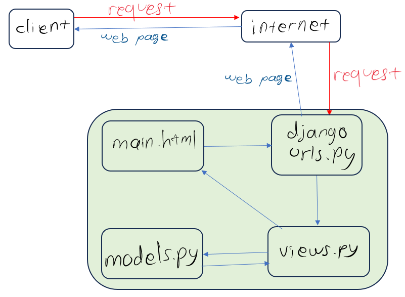
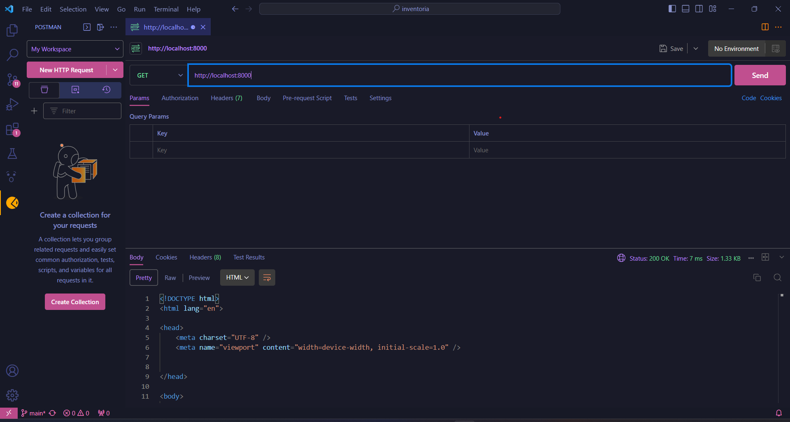
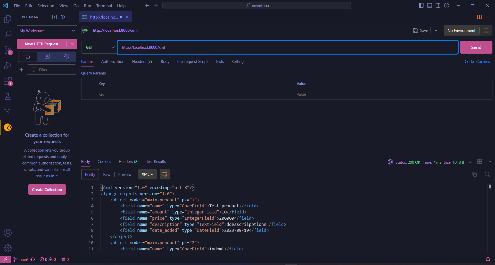
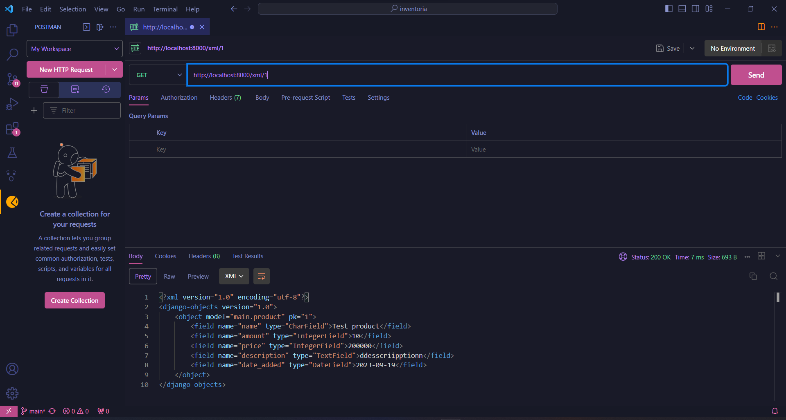
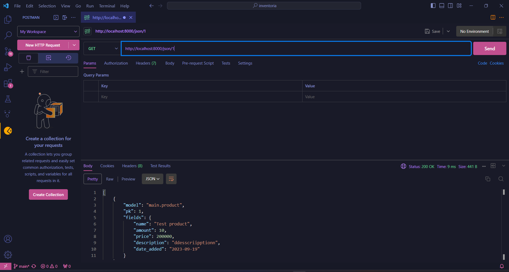

link app: https://inventori.adaptable.app/main/
akun adaptable diban

Jelaskan bagaimana cara kamu mengimplementasikan checklist di atas secara step-by-step (bukan hanya sekadar mengikuti tutorial).
1. Membuat repository di github dan lokal bernama inventoria.
2. Menghubungkan repositori lokal dengan repositori di GitHub dengan command:
    `git branch -M main` dan
    `git remote add origin https://github.com/ArditheusIH/inventoria.git`
3. Membuat virtual environment pada directory inventoria dengan command:
    `python -m venv env`
    dan mengaktifkannya dengan command:
    `env\Scripts\activate`
4. membuat berkas requirements.txt dan menambahkan beberapa dependencies.Kemudian install dengan command
    `pip install -r requirements.txt`
5. Buat proyek Django baru bernama inventoria dengan command
    `django-admin startproject inventoria .`
6. Tambahkan * pada ALLOWED_HOSTS di berkas settings.py
7. Membuat berkas .gitignore dan melakukan add, commit, dan push ke github.
    ```
    # Django
    *.log
    *.pot
    *.pyc
    __pycache__
    db.sqlite3
    media

    # Backup files
    *.bak 

    # If you are using PyCharm
    # User-specific stuff
    .idea/**/workspace.xml
    .idea/**/tasks.xml
    .idea/**/usage.statistics.xml
    .idea/**/dictionaries
    .idea/**/shelf

    # AWS User-specific
    .idea/**/aws.xml

    # Generated files
    .idea/**/contentModel.xml

    # Sensitive or high-churn files
    .idea/**/dataSources/
    .idea/**/dataSources.ids
    .idea/**/dataSources.local.xml
    .idea/**/sqlDataSources.xml
    .idea/**/dynamic.xml
    .idea/**/uiDesigner.xml
    .idea/**/dbnavigator.xml

    # Gradle
    .idea/**/gradle.xml
    .idea/**/libraries

    # File-based project format
    *.iws

    # IntelliJ
    out/

    # JIRA plugin
    atlassian-ide-plugin.xml

    # Python
    *.py[cod] 
    *$py.class 

    # Distribution / packaging 
    .Python build/ 
    develop-eggs/ 
    dist/ 
    downloads/ 
    eggs/ 
    .eggs/ 
    lib/ 
    lib64/ 
    parts/ 
    sdist/ 
    var/ 
    wheels/ 
    *.egg-info/ 
    .installed.cfg 
    *.egg 
    *.manifest 
    *.spec 

    # Installer logs 
    pip-log.txt 
    pip-delete-this-directory.txt 

    # Unit test / coverage reports 
    htmlcov/ 
    .tox/ 
    .coverage 
    .coverage.* 
    .cache 
    .pytest_cache/ 
    nosetests.xml 
    coverage.xml 
    *.cover 
    .hypothesis/ 

    # Jupyter Notebook 
    .ipynb_checkpoints 

    # pyenv 
    .python-version 

    # celery 
    celerybeat-schedule.* 

    # SageMath parsed files 
    *.sage.py 

    # Environments 
    .env 
    .venv 
    env/ 
    venv/ 
    ENV/ 
    env.bak/ 
    venv.bak/ 

    # mkdocs documentation 
    /site 

    # mypy 
    .mypy_cache/ 

    # Sublime Text
    *.tmlanguage.cache 
    *.tmPreferences.cache 
    *.stTheme.cache 
    *.sublime-workspace 
    *.sublime-project 

    # sftp configuration file 
    sftp-config.json 

    # Package control specific files Package 
    Control.last-run 
    Control.ca-list 
    Control.ca-bundle 
    Control.system-ca-bundle 
    GitHub.sublime-settings 

    # Visual Studio Code
    .vscode/* 
    !.vscode/settings.json 
    !.vscode/tasks.json 
    !.vscode/launch.json 
    !.vscode/extensions.json 
    .history
    ```
8. Membuat aplikasi dengan nama main dengan command
    `python manage.py startapp main`
9. menambahkan aplikasi main ke proyek inventoria
10. membuat template html main.html yang berisi
    ```   
    <h1>Inventory</h1>
    <h5>Name: </h5>
    <p>{{ name }}<p>
    <h5>Amount: </h5>
    <p>{{ amount }}<p>
    <h5>Price: </h5>
    <p>{{ price }}<p>
    <h5>Description: </h5>
    <p>{{ description }}<p>
    ```
11. mengisi models.py dengan
    ```
    class Product(models.Model):
    name = models.CharField(max_length=255)
    amount = models.IntegerField()
    price = models.IntegerField()
    description = models.TextField()"
    ```
12. memigrasi model dengan command `python manage.py makemigrations` lalu `python manage.py migrate`

13. Mengisi views.py dengan
    ```
    from django.shortcuts import render
    def show_main(request):
        context = {
            'name': 'Minyak goreng',
            'amount': '100',
            'price': '20000',
            'description': 'Minyak untuk menggoreng makanan',
        }

        return render(request, "main.html", context)
    ```
14. membuat urls.py di dalam main
    ``` 
    from django.urls import path
    from main.views import show_main

    app_name = 'main'

    urlpatterns = [
        path('', show_main, name='show_main'),
    ]
    ```
    
15. mengisi menambahkan `path('main/', include('main.urls')),` pada urls.py di dalam inventoria
16. melakukan testing
    ```
    from django.test import TestCase
    from main.models import Product

    '''This test checks if the attributes are using the correct data type'''
    class mainTest(TestCase):
        def test_field_data_type(self):
            product = Product(name="minyak", amount=100, price=20000, description="goreng")
            
            self.assertIsInstance(product.name, str)
            self.assertIsInstance(product.amount, int)
            self.assertIsInstance(product.price, int)
            self.assertIsInstance(product.description, str)
    ```
17. melakukan add commit push ke github
18. mendeploy ke adaptable.io

Buatlah bagan yang berisi request client ke web aplikasi berbasis Django beserta responnya dan jelaskan pada bagan tersebut kaitan antara urls.py, views.py, models.py, dan berkas html


`urls.py` berfungsi untuk mengatur rute yang diinginkan (dalam kasus ini app main) sehingga web yang dibuka adalah main. `models.py` berfungsi untuk mengatur struktur database dan mengakses data. `views.py` berisi logic aplikasinya. Setelah menerima permintaan dari router(`urls.py`), `views.py` akan memproses permintaan tersebut, mengambil atau memanipulasi data dari `models.py`, dan kemudian merender template HTML. `main.html` untuk merancang tampilan yang  diisi dengan data dari `models.py` melalui `views.py`

Jelaskan mengapa kita menggunakan virtual environment? Apakah kita tetap dapat membuat aplikasi web berbasis Django tanpa menggunakan virtual environment?

Ada beberapa alasan kita menggunakan virtual environment. Proyek kita menjadi lebih teratur dan bersih. Virtual environment memungkinkan kita untuk membuat lingkungan tertutup yang terpisah untuk setiap proyek yang berbeda. Kita juga bisa menginstall dependency yang berbeda-beda untuk setiap proyek.
Kita bisa saja tidak menggunakan virtual environment, tetapi ini tidak bagus untuk mengerjakan lebih dari satu proyek karena hal ini membuat proyek-proyek berbagi sumber daya dan lingkungan yang sama padahal mungkin kebutuhannya berbeda-beda. 

Jelaskan apakah itu MVC, MVT, MVVM dan perbedaan dari ketiganya.

MVC(Model-View-Controller) adalah suatu framework pola arsitektur yang membuat aplikasi terbagi ke dalam 3 komponen utama, yaitu model, view, serta controller. Controller berfungsi untuk menghubungkan dan mengontrol model serta view supaya bisa saling terkoneksi. Controller Bertanggung jawab untuk mengelola input pengguna, mengubah model sesuai dengan input tersebut, dan mengatur tampilan yang harus diperbarui.
MVT(Model-View-Template) adalah sebuah konsep arsitektur yang diterapkan dalam pengembangan web dengan tujuan memisahkan elemen-elemen utama dari sebuah aplikasi. Konsep ini memungkinkan pengembang web untuk mengorganisasi dan mengelola kode dengan lebih terstruktur.
MVVM(Model-View-ViewModel) mirip dengan MVC dan MVT. ViewModel berfungsi untuk mengelola tampilan dan logika tampilan. Ini berperan sebagai perantara antara model dan view, tetapi dengan lebih banyak kontrol terhadap tampilan. ViewModel biasanya mengikat data antara model dan view.

"""JAWABAN TUGAS 3"""

Apa perbedaan antara form POST dan form GET dalam Django?

Biasanya kita menggunakan POST untuk mengirim data ke server dan GET untuk mengambil data dari server. Keduanya bisa untuk mengirim data ke server, tetapi method GET akan menampilkan data yang dikirim pada address bar browser. Oleh karena itu, tidak aman menggunakan GET untuk mengirim data penting seperti user dan password. Sehingga lebih baik menggunakan POST untuk mengirimkan data pada server.

Apa perbedaan utama antara XML, JSON, dan HTML dalam konteks pengiriman data?
    
XML dan JSON keduanya bisa dipakai untuk mengirimkan data. XML biasanya memiliki lebih banyak karakter, sehingga bisa lebih besar dalam ukuran dibandingkan dengan JSON. Hal ini dapat mempengaruhi kinerja dan kecepatan transfer data. XML dirancang untuk merepresentasikan dan menyimpan data terstruktur.
JSON lebih ringan, memiliki sintaks yang lebih ringkas dan simple, dan memerlukan lebih sedikit karakter dibandingkan dengan XML. Hal ini berakibat JSON lebih efisien.
Sedangkan HTML digunakan untuk membuat tampilan halaman web dan menyusun bagaimana data akan ditampilkan sesuai keinginan kita.
    
Mengapa JSON sering digunakan dalam pertukaran data antara aplikasi web modern?

Karena JSON mensupport data type numbers, objects, strings, dan Boolean arrays. Selain itu, JSON juga memiliki ukuran file yang lebih kecil dan kecepatan transfer datanya juga lebih cepat.


 Jelaskan bagaimana cara kamu mengimplementasikan checklist di atas secara step-by-step (bukan hanya sekadar mengikuti tutorial).

 1. Membuat kerangka views dengan membuat berkas base.html pada root/templates
    ```
    
    <!DOCTYPE html>
    <html lang="en">
        <head>
            <meta charset="UTF-8" />
            <meta
                name="viewport"
                content="width=device-width, initial-scale=1.0"
            />
            
            
        </head>

        <body>
            
            
        </body>
    </html>
    ```

2. menambahkan `BASE_DIR / 'templates'` pada DIRS didalam `settings.py` sehingga `base.html` terdeteksi.
3. Mengedit `main.html` sehingga main menggunakan template `base.html` sebagai template utama, menampilkan tabel dan tombol add product.
    ```
    

    
    <h1>Inventory</h1>

        <table>
            <tr>
                <th>Name</th>
                <th>Amount</th>
                <th>Price</th>
                <th>Description</th>
                <th>Date Added</th>
            </tr>
        
             Berikut cara memperlihatkan data produk di bawah baris ini 
        
            
                <tr>
                    <td>{{product.name}}</td>
                    <td>{{product.amount}}</td>
                    <td>{{product.price}}</td>
                    <td>{{product.description}}</td>
                    <td>{{product.date_added}}</td>
                </tr>
            
        </table>
        
        <br />
        
        <a href="">
            <button>
                Add New Product
            </button>
        </a>

    
    ```
4. membuat `forms.py` pada main dengan isi
    ```
    from django.forms import ModelForm
    from main.models import Product

    class ProductForm(ModelForm):
        class Meta:
            model = Product
            fields = ["name", "amount", "price", "description"]
    ```
5. Menambahkan import-import pada `views.py` pada main 
    ```
    from django.http import HttpResponseRedirect
    from main.forms import ProductForm
    from django.urls import reverse
    from main.models import Product
    from django.http import HttpResponse
    from django.core import serializers
    ```
6. membuat fungsi `create_product` pada `views.py`
    ```
    def create_product(request):
    form = ProductForm(request.POST or None)

    if form.is_valid() and request.method == "POST":
        form.save()
        return HttpResponseRedirect(reverse('main:show_main'))

    context = {'form': form}
    return render(request, "create_product.html", context)
    ```
7. mengubah fungsi `show_main` menjadi
    ```
    def show_main(request):
    products = Product.objects.all()
    context = {
        'name': 'Arditheus', # Nama kamu
        'class': 'PBP A', # Kelas PBP kamu
        'products' : products
    }

    return render(request, "main.html", context)
    ```
8. membuat berkas `create_product.html` pada `main/templates`
    ```
     

    
    <h1>Add New Product</h1>

    <form method="POST">
        
        <table>
            {{ form.as_table }}
            <tr>
                <td></td>
                <td>
                    <input type="submit" value="Add Product"/>
                </td>
            </tr>
        </table>
    </form>

    
    ```
9. menambahkan fungsi-fungsi untuk melihat objek yang sudah ditambahkan dalam format HTML, XML, JSON, XML by ID, dan JSON by ID, pada `views.py`
    ```
    def show_xml(request):
    data = Product.objects.all()
    return HttpResponse(serializers.serialize("xml", data), content_type="application/xml")

    def show_json(request):
        data = Product.objects.all()
        return HttpResponse(serializers.serialize("json", data), content_type="application/json")

    def show_xml_by_id(request, id):
        data = Product.objects.filter(pk=id)
        return HttpResponse(serializers.serialize("xml", data), content_type="application/xml")

    def show_json_by_id(request, id):
        data = Product.objects.filter(pk=id)
        return HttpResponse(serializers.serialize("json", data), content_type="application/json")
    ```

10. mengimpor fungsi fungsi tersebut pada `urls.py` yang ada di dir main.
    ```
    from main.views import show_main, create_product, show_xml, show_json, show_xml_by_id, show_json_by_id 
    ```
11. menambahkan path-path fungsi tersebut pada `urls.py` yang ada di dir main.
    ```
    urlpatterns = [
    path('', show_main, name='show_main'),
    path('create-product', create_product, name='create_product'),
    path('xml/', show_xml, name='show_xml'), 
    path('json/', show_json, name='show_json'), 
    path('xml/<int:id>/', show_xml_by_id, name='show_xml_by_id'),
    path('json/<int:id>/', show_json_by_id, name='show_json_by_id'), 
    ]
    ```

postman html


postman xml


postman xml id


postman json


postman json id


"""JAWABAN TUGAS 4"""

1 Apa itu Django UserCreationForm, dan jelaskan apa kelebihan dan kekurangannya?

UserCreationForm adalah suatu class yang disediakan oleh Django authentication framework untuk mempermudah membuat form registrasi pengguna. Kelebihannya adalah sangat cepat dan mudah untuk membuat form registrasi user. Bisa juga di modifikasi untuk membuat form registrasi yang lebih kompleks. Kelemahannya adalah UserCreationForm hanya menyediakan field yang dasar saja yaitu username dan password sehingga butuh dicustom lagi untuk membuat field lain yang dibutuhkan.

2 Apa perbedaan antara autentikasi dan otorisasi dalam konteks Django, dan mengapa keduanya penting?

Autentikasi adalah proses memverifikasi identitas pengguna biasanya menggunakan username dan password. Otorisasi adalah proses menentukan tindakan atau resource apa yang user bisa akses pada suatu sistem. Autentikasi penting karena untuk mencegah orang untuk bisa menyamar sebagai orang lain. Otorisasi penting untuk mencegah orang lain melihat, memodifikasi, atau menghapus data pribadi kita.

3 Apa itu cookies dalam konteks aplikasi web, dan bagaimana Django menggunakan cookies untuk mengelola data sesi pengguna?

cookies adalah data kecil yang dikirim oleh web server kepada browser pengguna dan disimpan pada device pengguna. 

4 Apakah penggunaan cookies aman secara default dalam pengembangan web, atau apakah ada risiko potensial yang harus diwaspadai?

Biasanya aman, tetapi ada beberapa risiko potensial yang harus diwaspadai. Contohnya tipe data yang disimpan dalam cookies tidak boleh berupa data sensitive seperti password

5 Jelaskan bagaimana cara kamu mengimplementasikan checklist di atas secara step-by-step (bukan hanya sekadar mengikuti tutorial).

1. Membuat fungsi register pada `views.py` yang ada di main
    ```
    def register(request):
    form = UserCreationForm()

    if request.method == "POST":
        form = UserCreationForm(request.POST)
        if form.is_valid():
            form.save()
            messages.success(request, 'Your account has been successfully created!')
            return redirect('main:login')
    context = {'form':form}
    return render(request, 'register.html', context)
    ```

2. Membuat template baru bernama `register.html` pada main/templates
    ```
    

    
        <title>Register</title>
    

      

    <div class = "login">
        
        <h1>Register</h1>  

            <form method="POST" >  
                  
                <table>  
                    {{ form.as_table }}  
                    <tr>  
                        <td></td>
                        <td><input type="submit" name="submit" value="Daftar"/></td>  
                    </tr>  
                </table>  
            </form>

          
            <ul>   
                  
                    <li>{{ message }}</li>  
                      
            </ul>   
        

    </div>  

    
    ```

3. Tambahkan path register pada `urls.py`.
    ```path('register/', register, name='register'),```

4. membuat fungsi login
    ```
    def login_user(request):
        if request.method == 'POST':
        username = request.POST.get('username')
        password = request.POST.get('password')
        user = authenticate(request, username=username, password=password)
        if user is not None:
            login(request, user)
            response = HttpResponseRedirect(reverse("main:show_main")) 
            response.set_cookie('last_login', str(datetime.datetime.now()))
            return response
        else:
            messages.info(request, 'Sorry, incorrect username or password. Please try again.')
    context = {}
    return render(request, 'login.html', context)
    ```

5. membuat template baru bernama `login.html` 
    ```
    

    
        <title>Login</title>
    

    

    <div class = "login">

        <h1>Login</h1>

        <form method="POST" action="">
            
            <table>
                <tr>
                    <td>Username: </td>
                    <td><input type="text" name="username" placeholder="Username" class="form-control"></td>
                </tr>
                        
                <tr>
                    <td>Password: </td>
                    <td><input type="password" name="password" placeholder="Password" class="form-control"></td>
                </tr>

                <tr>
                    <td></td>
                    <td><input class="btn login_btn" type="submit" value="Login"></td>
                </tr>
            </table>
        </form>

        
            <ul>
                
                    <li>{{ message }}</li>
                
            </ul>
             
            
        Don't have an account yet? <a href="">Register Now</a>

    </div>

    
    ```

6. menambahkan path ke `urls.py`
    ```path('login/', login_user, name='login'),```

7. Membuat fungsi logout
    ```
    def logout_user(request):
        logout(request)
        response = HttpResponseRedirect(reverse('main:login'))
        response.delete_cookie('last_login')
        return response
    ```

8. membuat tombol logout pada `main.html`
    ```
    <a href="">
        <button>
            Logout
        </button>
    </a>
    ```

9. Menambahkan  kode `@login_required(login_url='/login')` di atas fungsi show_main agar halaman main hanya dapat diakses oleh pengguna yang sudah login.

10. menambahkan potongan kode `'last_login': request.COOKIES['last_login']` ke dalam variabel context pada fungsi `show_main`.
    ```
    context = {
        'name': 'Pak Bepe',
        'class': 'PBP A',
        'products': products,
        'last_login': request.COOKIES['last_login'],
    }
    ```

11. menambahkan `<h5>Sesi terakhir login: {{ last_login }}</h5>` untuk menampilkan data last login.

12. Membuat 2 user dan 3 dummy product

12. Menambahkan kode `user = models.ForeignKey(User, on_delete=models.CASCADE)` pada model Product pada `models.py`

13. Mengubah `create_product` menjadi 
    ```
    def create_product(request):
        form = ProductForm(request.POST or None)

        if form.is_valid() and request.method == "POST":
            product = form.save(commit=False)
            product.user = request.user
            product.save()
            return HttpResponseRedirect(reverse('main:show_main'))

        context = {'form': form}
        return render(request, "create_product.html", context)
    ```

14. mengubah fungsi `show_main`
    ```
    def show_main(request):
    products = Product.objects.filter(user=request.user)

    context = {
        'name': request.user.username,
        ...
    ...
    ```

15. Melakukan migration

16. membuat fungsi `increase_amount` untuk menambahkan amount sebanyak 1
    ```
    def increase_amount(request, id):
        updated_product = Product.objects.get(pk=id)
        updated_product.amount += 1
        updated_product.save()
        return HttpResponseRedirect(reverse('main:show_main'))
    ```

17. membuat fungsi `decrease_amount` untuk mengurangi amount sebanyak 1
    ```
    def decrease_amount(request, id):
        if updated_product.amount >0:
            updated_product.amount -= 1
            updated_product.save()
        return HttpResponseRedirect(reverse('main:show_main'))
    ```

18. membuat fungsi `remove_product` untuk menghapus product
    ```
    def remove_product(request,id):
        updated_product = Product.objects.get(pk=id)
        updated_product.delete()
        return HttpResponseRedirect(reverse('main:show_main'))
    ```

19. membuat 3 tombol pada `main.html`
    ```
    ...
    <tr>
        <td>{{product.name}}</td>
        <td>{{product.amount}}</td>
        <td>{{product.price}}</td>
        <td>{{product.description}}</td>
        <td>{{product.date_added}}</td>
        <td><a href=""><button>+1</button></a></td>
        <td><a href=""><button>-1</button></a></td>
        <td><a href=""><button>remove</button></a></td>
    </tr>
    ...
    ```

20. menambahkan path pada  `urls.py`
    ```
    path('register/', register, name='register'), 
    path('login/', login_user, name='login'),
    path('logout/', logout_user, name='logout'),
    path('increase-amount/<int:id>', increase_amount, name='increase_amount'),
    path('decrease-amount/<int:id>', decrease_amount, name='decrease_amount'),
    path('remove-product/<int:id>', remove_product, name='remove_product'),
    ```

"""TUGAS 5"""
Jelaskan HTML5 Tag yang kamu ketahui.

tag `<header>` adalah tag untuk membuat header pada dokumen atau bagian web.
tag `<font>` untuk memodifikasi warna, ukuran, dan style dari sebuah text.
tag `<figure>` adalah tag untuk menampung konten seperti ilustrasi, diagram, foto, atau kode
tag `<details>` digunakan untuk informasi yang hidden tetapi bisa ditampilakan jika user menginginkannya.

Jelaskan perbedaan antara margin dan padding.

padding adalah area transparan di sekitar setiap objek/elemen/konten sedangkan margin adalah area transparan paling luar dari sebuah box model.

Jelaskan bagaimana cara kamu mengimplementasikan checklist di atas secara step-by-step

1. Menambahkan Bootstrap CSS dan JS pada base.html
    ```
    <link href="https://cdn.jsdelivr.net/npm/bootstrap@5.3.2/dist/css/bootstrap.min.css" rel="stylesheet" integrity="sha384-T3c6CoIi6uLrA9TneNEoa7RxnatzjcDSCmG1MXxSR1GAsXEV/Dwwykc2MPK8M2HN" crossorigin="anonymous">
    <script src="https://code.jquery.com/jquery-3.6.0.min.js" integrity="sha384-KyZXEAg3QhqLMpG8r+J4jsl5c9zdLKaUk5Ae5f5b1bw6AUn5f5v8FZJoMxm6f5cH1" crossorigin="anonymous"></script>
    <script src="https://cdn.jsdelivr.net/npm/@popperjs/core@2.11.8/dist/umd/popper.min.js" integrity="sha384-I7E8VVD/ismYTF4hNIPjVp/Zjvgyol6VFvRkX/vR+Vc4jQkC+hVqc2pM8ODewa9r" crossorigin="anonymous"></script>
    <script src="https://cdn.jsdelivr.net/npm/bootstrap@5.3.2/dist/js/bootstrap.min.js" integrity="sha384-BBtl+eGJRgqQAUMxJ7pMwbEyER4l1g+O15P+16Ep7Q9Q+zqX6gSbd85u4mG4QzX+" crossorigin="anonymous"></script>
    ```

2. membuat navbar.html di dalam root/templates
    ```
    <nav class="navbar navbar-expand-lg bg-body-tertiary">
        <div class="container-fluid">
        <a class="navbar-brand" href="">Inventory</a>
        <button class="navbar-toggler" type="button" data-bs-toggle="collapse" data-bs-target="#navbarText" aria-controls="navbarText" aria-expanded="false" aria-label="Toggle navigation">
            <span class="navbar-toggler-icon"></span>
        </button>
        <div class="collapse navbar-collapse" id="navbarText">
            <ul class="navbar-nav me-auto mb-2 mb-lg-0">
            <li class="nav-item">
                <a class="nav-link active" aria-current="page" href="">Home</a>
            </li>
            </ul>
            <span class="navbar-text">
            Username: {{name}} | 
            Class: {{class}}
            </span>
        </div>
        </div>
    </nav>
    ```

3. Menambahkan `` pada semua template di main/templates.

4. Menambahkan fitur edit_product
    ```
    def edit_product(request, id):
        # Get product berdasarkan ID
        product = Product.objects.get(pk = id)

        # Set product sebagai instance dari form
        form = ProductForm(request.POST or None, instance=product)

        if form.is_valid() and request.method == "POST":
            # Simpan form dan kembali ke halaman awal
            form.save()
            return HttpResponseRedirect(reverse('main:show_main'))

        context = {'form': form}
        return render(request, "edit_product.html", context)
    ```

5. Memodifikasi tabel inventori pada main.html
    ```
    <table class="table table table-hover">
        <tr>
            <th>Name</th>
            <th>Amount</th>
            <th>Price</th>
            <th>Description</th>
            <th>Date Added</th>
        </tr>
    
         Berikut cara memperlihatkan data produk di bawah baris ini 
        
        
            <tr>
                <td>{{product.name}}</td>
                <td>{{product.amount}}</td>
                <td>{{product.price}}</td>
                <td>{{product.description}}</td>
                <td>{{product.date_added}}</td>
                <td><a href=""><button class = "btn btn-light">+1</button></a>
                <a href=""><button class = "btn btn-light">-1</button></a></td>
                <td><a href="">
                        <button class = "btn btn-secondary">
                            Edit
                        </button></a>
                <a href=""><button type="button" class="btn btn-danger">
                    remove
                </button></a></td>
            </tr>
        
    </table>
    ```

6. Memberi warna button button yang ada dengan menambahkan kode `class = "btn btn-primary"`, `class = "btn btn-secondary"`, atau ``class = "btn btn-danger"``.
